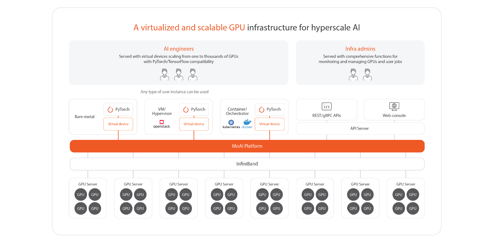

# MoAI Platform Overview

## What is MoAI Platform?

The MoAI Platform is a scalable AI platform designed for developing large-scale deep learning models. It allows easy control of thousands of different GPUs to facilitate AI model training and inference. 

## Core Technologies of MoAI Platform

As deep learning models evolve, they become increasingly complex and require substantial computational resources, with parameters expanding from billions to trillions. Developing large-scale models involves managing and processing an immense number of parameters, which is very challenging and time-consuming.

Additionally, issues such as GPU node failures, memory limitations, and bottlenecks frequently arise during the training and inference of large-scale models, making the resolution of these problems particularly challenging. The MoAI Platform addresses these limitations and challenges with its GPU virtualization and automatic parallelization features, providing an efficient infrastructure for the era of large-scale AI.

1. **[Various Accelerators, Multi-GPU Support](http://localhost:5000/two-lang-demo/about-moai/#1various-accelerators-multi-gpu-support)**
2. **[GPU Virtualization](http://localhost:5000/two-lang-demo/about-moai/#2-gpunpu-virtualization)**
3. **[Dynamic GPU Allocation]()**
4. **[AI Compiler Automatic Parallelization]()**

---

## 1. Various Accelerators, Multi-GPU Support

-

- MoAI Platform supports various accelerators capable of executing various types of operations regardless of types of GPUs.
- Users can utilize different accelerators like Intel, AMD, and others alongside NVIDIA without needing to modify their code for deep learning development and model training.
- This compatibility allows for flexible development and training of deep learning models, accommodating multiple and diverse types of GPUs.\
\
&nbsp;
------
## 2. GPU Virtualization

-
The MoAI Platform’s virtualization feature enables the use of thousands of GPUs as if they were a single GPU. This simplifies the modeling and optimization processes, providing AI engineers with a smooth and efficient experience.

- **Flexible Scalability**: You can scale GPU resources up or down as needed, enhancing the scalability of your services.
- **Simplified Management and Deployment**: By abstracting the complexity of using multiple GPUs, the platform makes it easier to manage and deploy resources to improve performance in deep learning tasks.
- **Cost Savings**: GPU infrastructure managers can reduce hardware costs by efficiently utilizing virtualized GPUs.

The MoAI Platform is designed with a fully usage-based billing model, where charges are applied per minute of GPU usage only during actual computations. This approach allows for significant cost savings compared to traditional cloud services, which often tie GPUs to specific virtual machines(VMs) using a passthrough method.

- **Comparison Examples**:
    - **Google Cloud**: Google Cloud charges on a per-second basis for each machine. However, resources are fixed, making it difficult to change virtual machines once selected.
    - **Azure**: Azure charges for computing capacity on a per-second basis and allows for adjustments in consumption as needed, but does not offer flexible instance changes based on training requirements.
    - **MoAI Platform**: The MoAI Platform offers precise billing based on AI accelerator size and GPU computation time, providing more efficient cost management.
\
&nbsp;

------

## 3. Dynamic GPU Allocation

On the MoAI Platform, AI engineers can start deep learning training and inference with only the necessary amount of GPU resources.

- **Efficient GPU Resource Utilization**: GPU resources are allocated only during computation, ensuring efficient use. This approach helps reduce software and infrastructure development costs and shortens development and deployment times.
- **Easy Cluster Setup**: With the MoAI Platform's dynamic allocation feature, AI engineers can easily set up GPU clusters. Typically, deep learning developers need to configure their development environment by connecting PyTorch or TensorFlow to the back nodes of GPU cluster devices, ensuring that each process can communicate with others.

## 4. AI Compiler Automatic Parallelization

!!!info What is Automatic Parallelization?
Deep learning models consist of multiple layers, each containing numerous computations. These layers can be trained independently, allowing for parallel processing. GPU automatic parallelization is a technology that automates the parallelization of training and inference in deep learning models.
!!!

The MoAI Platform's Advanced Parallelization technology optimally distributes and parallelizes these computations, maximizing hardware resource utilization.

In the era of artificial intelligence, large-scale models like Large Language Models (LLMs) and Large Multimodal Models (LMMs) require substantial GPU clusters and effective GPU parallelization for training and inference.

Currently, common AI frameworks used with NVIDIA require AI engineers to manually adjust parallelization based on the model's size, complexity, and the available GPU size or cluster. This process is time-consuming, often taking several weeks.

- The MoAI Platform provides Advanced Parallelization through the Moreh AI compiler, which optimally utilizes GPU resources based on the specific AI model and GPU cluster size.
- With MoAI Platform’s Advanced Parallelization, the setup and deployment time for AI models, typically weeks long, can be  dramatically reduced to approximately 2-3 days.

