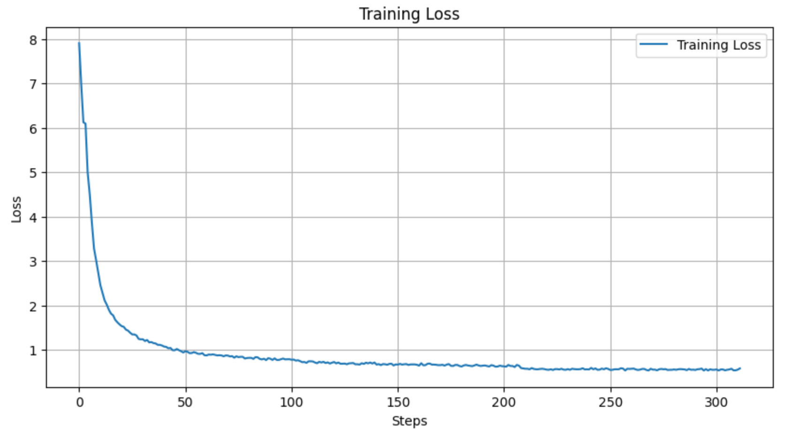

# 3. Model fine-tuning

Now, we will train the model through the following process. 

## Setting Accelerator Flavor

In MoAI Platform, physical GPUs are not directly exposed to users. Instead, virtual MoAI Accelerators are provided, which are available for use in PyTorch. By setting the accelerator's flavor, you can determine how much of the physical GPU will be utilized by PyTorch. Since the total training time and GPU usage cost vary depending on the selected accelerator flavor, users should make decisions based on their training scenarios. Refer to the following document to select the accelerator Flavor that aligns with your training objectives.

- ***[KT Hyperscale AI Computing (HAC) 서비스 가속기 모델 정보](/Supported_Documents/KT_HAC_Models_Info.md)***  
- [LLM Fine-tuning 파라미터 가이드](/Supported_Documents/LLM_param_guide.md)

!!!
Please refer to the document above or reach out to your infrastructure provider to inquire about the GPU types and quantities corresponding to each flavor.
!!!

***(모든 문서에 추가될 그림 생성 예정)***

You can choose one of the following flavors to proceed:

- AMD MI250 GPU with 16 units:
    - Select [!badge variant="secondary" text="4xlarge"] when using Moreh's trial container.
    - Select [!badge variant="secondary" text="4xLarge.2048GB"] when using KT Cloud's Hyperscale AI Computing.
- AMD MI210 GPU with 32 units.
- AMD MI300X GPU with 8 units.

Remember we checked the MoAI Accelerator in the previous [Baichuan2 Finetuning](index.md) step? Now, let's set up the required accelerators for the actual training process.

First, we'll use the `moreh-smi` command to check the currently used MoAI Accelerator.


```bash
$ moreh-smi
11:40:36 April 16, 2024
+-------------------------------------------------------------------------------------------------+
|                                                Current Version: 24.3.0  Latest Version: 24.3.0  |
+-------------------------------------------------------------------------------------------------+
|  Device  |        Name         |     Model    |  Memory Usage  |  Total Memory  |  Utilization  |
+=================================================================================================+
|  * 0     |   MoAI Accelerator  |  Large.256GB  |  -             |  -             |  -            |
+-------------------------------------------------------------------------------------------------+
```
The current MoAI Accelerator in use has a memory size of 256GB.

You can utilize the `moreh-switch-model` command to review the available accelerator flavors on the current system. For seamless model training, consider using the `moreh-switch-model`command to switch to a MoAI Accelerator with larger memory capacity.


```bash
$ moreh-switch-model
Current MoAI Accelerator: Large.256GB

1. Small.64GB 
2. Medium.128GB 
3. Large.256GB  *
4. xLarge.512GB 
5. 1.5xLarge.768GB 
6. 2xLarge.1024GB 
7. 3xLarge.1536GB 
8. 4xLarge.2048GB 
9. 6xLarge.3072GB 
10. 8xLarge.4096GB 
11. 12xLarge.6144GB 
12. 24xLarge.12288GB 
13. 48xLarge.24576GB 
```

You can enter the number to switch to a different flavor.

In this tutorial, we will use a 2048GB-sized MoAI Accelerator.

Therefore, after switching from the initially set [!badge variant="secondary" text="Large.256GB"] flavor to [!badge variant="secondary" text="4xLarge.2048GB"], we will use the **`moreh-smi`** command to confirm that the change has been successfully applied.

Enter 8 to use [!badge variant="secondary" text="4xLarge.2048GB"].


```bash
Selection (1-13, q, Q): 8
The MoAI Accelerator flavor is successfully switched to  "4xLarge.2048GB".

1. Small.64GB 
2. Medium.128GB 
3. Large.256GB 
4. xLarge.512GB 
5. 1.5xLarge.768GB 
6. 2xLarge.1024GB 
7. 3xLarge.1536GB 
8. 4xLarge.2048GB *
9. 6xLarge.3072GB 
10. 8xLarge.4096GB 
11. 12xLarge.6144GB 
12. 24xLarge.12288GB 
13. 48xLarge.24576GB 

Selection (1-13, q, Q): q
```

Enter **`q`** to complete the change.

To confirm that the changes have been successfully applied, use the **`moreh-smi`** command again to check the currently used MoAI Accelerator.

```bash
$ moreh-smi
+-----------------------------------------------------------------------------------------------------+
|                                                    Current Version: 24.3.0  Latest Version: 24.2.0  |
+-----------------------------------------------------------------------------------------------------+
|  Device  |        Name         |       Model      |  Memory Usage  |  Total Memory  |  Utilization  |
+=====================================================================================================+
|  * 0     |  KT AI Accelerator  |  4xLarge.2048  |  -             |  -             |  -            |
+-----------------------------------------------------------------------------------------------------+
```

Now you can see that it has been successfully changed to [!badge variant="secondary" text="4xLarge.2048GB"].

# Training Execution

Execute the `train_baichuan2_13b.py` script below.

```
$ cd ~/quickstart
~/quickstart$ python tutorial/train_baichuan2_13b.py
```

If the training proceeds smoothly, you should see the following logs. By going through this logs, you can verify that the Advanced Parallelism feature, which determines the optimal parallelization settings, is functioning properly. It's worth noting that, apart from the single line of AP code we looked at earlier in the PyTorch script, there is no handling for using multiple GPUs simultaneously in other parts of the script.

```bash
2024-04-25 18:31:36,493 - torch.distributed.nn.jit.instantiator - INFO - Created a temporary directory at /tmp/tmph165oq0w
2024-04-25 18:31:36,494 - torch.distributed.nn.jit.instantiator - INFO - Writing /tmp/tmph165oq0w/_remote_module_non_scriptable.py
2024-04-25 18:31:54,239 - modeling_baichuan - WARNING - Xformers is not installed correctly. If you want to use memory_efficient_attention to accelerate training use the following command to install Xformers
pip install xformers.
The argument `trust_remote_code` is to be used with Auto classes. It has no effect here and is ignored.
The argument `trust_remote_code` is to be used with Auto classes. It has no effect here and is ignored.
^MLoading checkpoint shards:   0%|          | 0/3 [00:00<?, ?it/s]^MLoading checkpoint shards:  33%|███▎      | 1/3 [00:06<00:13,  6.88s/it]^MLoading checkpoint shards:  67%|██████▋   | 2/3 [00:13<00:06,  6.53s/it]^MLoading checkpoint shards: 100%|██████████| 3/3 [00:17<00:00,  5.40s/it]^MLoading checkpoint shards: 100%|██████████| 3/3 [00:17<00:00,  5.74s/it][2024-04-25 18:34:02.846] [info] Got DBs from backend for auto config.
[2024-04-25 18:34:04.427] [info] Requesting resources for KT AI Accelerator from the server...
[2024-04-25 18:34:04.438] [warning] A newer version of Moreh AI Framework is available. You can update the software to the latest version by running "update-moreh".
[2024-04-25 18:34:04.438] [info] Initializing the worker daemon for KT AI Accelerator
[2024-04-25 18:34:08.910] [info] [1/4] Connecting to resources on the server (192.168.110.7:24170)...
[2024-04-25 18:34:08.922] [info] [2/4] Connecting to resources on the server (192.168.110.42:24170)...
[2024-04-25 18:34:08.928] [info] [3/4] Connecting to resources on the server (192.168.110.72:24170)...
[2024-04-25 18:34:08.934] [info] [4/4] Connecting to resources on the server (192.168.110.93:24170)...
[2024-04-25 18:34:08.942] [info] Establishing links to the resources...
[2024-04-25 18:34:09.361] [info] KT AI Accelerator is ready to use.
[2024-04-25 18:34:09.627] [info] The number of candidates is 45.
[2024-04-25 18:34:09.627] [info] Parallel Graph Compile start...
[2024-04-25 18:34:21.670] [info] Elapsed Time to compile all candidates = 12043 [ms]
[2024-04-25 18:34:21.671] [info] Parallel Graph Compile finished.
[2024-04-25 18:34:21.671] [info] The number of possible candidates is 6.
[2024-04-25 18:34:21.671] [info] SelectBestGraphFromCandidates start...
[2024-04-25 18:34:23.154] [info] Elapsed Time to compute cost for survived candidates = 1483 [ms]
[2024-04-25 18:34:23.154] [info] SelectBestGraphFromCandidates finished.
[2024-04-25 18:34:23.154] [info] Configuration for parallelism is selected.
[2024-04-25 18:34:23.154] [info] No PP, No TP, recomputation : 1, distribute_param : true, distribute_low_prec_param : true
[2024-04-25 18:34:23.154] [info] train: true

2024-04-25 18:41:26.364 | INFO     | __main__:main:143 - [Step 1/104] Throughput : 590.2552103757937tokens/sec
2024-04-25 18:41:27.885 | INFO     | __main__:main:143 - [Step 2/104] Throughput : 190923.6976217358tokens/sec
2024-04-25 18:41:29.328 | INFO     | __main__:main:143 - [Step 3/104] Throughput : 189160.10152018082tokens/sec
2024-04-25 18:41:30.788 | INFO     | __main__:main:143 - [Step 4/104] Throughput : 196763.98302926356tokens/sec
2024-04-25 18:41:32.395 | INFO     | __main__:main:143 - [Step 5/104] Throughput : 178552.3508130907tokens/sec
2024-04-25 18:41:33.880 | INFO     | __main__:main:143 - [Step 6/104] Throughput : 196590.71636327292tokens/sec
2024-04-25 18:41:35.408 | INFO     | __main__:main:143 - [Step 7/104] Throughput : 190912.36004700614tokens/sec
2024-04-25 18:41:36.926 | INFO     | __main__:main:143 - [Step 8/104] Throughput : 191986.6925165269tokens/sec
2024-04-25 18:41:38.419 | INFO     | __main__:main:143 - [Step 9/104] Throughput : 195401.16844504434tokens/sec
```

You can confirm that the training is progressing smoothly by observing the loss values decreasing as follows.



The throughput displayed during training indicates how many tokens per second are being processed through the PyTorch script.

- When using 8 AMD MI250 GPUs: approximately 191605 tokens/sec

Approximate training time based on GPU type and quantity is as follows:

- When using 8 AMD MI250 GPUs: approximately 30 minutes


# Checking Accelerator Status During Training

During training, open another terminal and connect to the container. You can execute the `moreh-smi` command to observe the MoAI Accelerator occupying memory while the training script is running. Please check the memory occupancy of MoAI accelerator when the training loss appears in the execution log after the initialization process.


```bash
$ moreh-2004-vm15  pytorch | ubuntu  ~  moreh-smi
+-----------------------------------------------------------------------------------------------------+
|                                                    Current Version: 24.3.0  Latest Version: 24.2.0  |
+-----------------------------------------------------------------------------------------------------+
|  Device  |        Name         |       Model      |  Memory Usage  |  Total Memory  |  Utilization  |
+=====================================================================================================+
|  * 0     |  KT AI Accelerator  |  4xLarge.2048GB  |  191605 MiB   |  2096640 MiB   |  100 %        |
+-----------------------------------------------------------------------------------------------------+
```