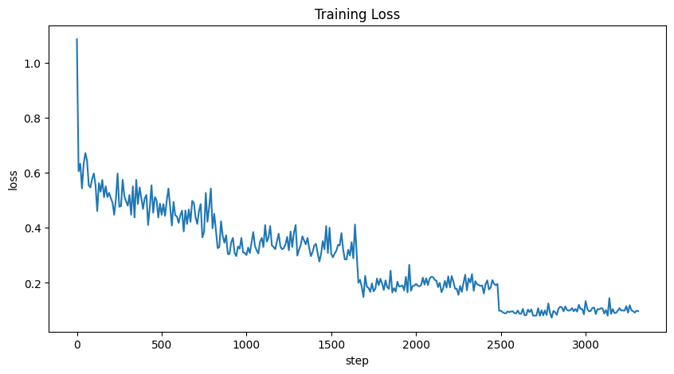

# 3. Model Fine-tuning

Now, we will train the model through the following process. 

# **Setting the Accelerator**

In MoAI Platform, physical GPUs are not directly exposed to users. Instead, virtual MoAI Accelerators are provided, which are available for use in PyTorch. By setting the accelerator's flavor, you can determine how much of the physical GPU will be utilized by PyTorch. Since the total training time and GPU usage cost vary depending on the selected accelerator flavor, users should make decisions based on their training scenarios. If needed, please refer to the [LLM Fine-tuning Parameter Guide](/Supported_Documents/LLM_param_guide.md) to select the accelerator Flavor that aligns with your training objectives.


!!!
Please refer to the document above or reach out to your infrastructure provider to inquire about the GPU types and quantities corresponding to each flavor.
!!!

You can choose one of the following flavors to proceed:

- AMD MI250 GPU with 16 units:
    - Select  [!badge variant="secondary" text="4xlarge"] when using Moreh's trial container.
    - Select [!badge variant="secondary" text="4xLarge.2048GB"] when using KT Cloud's Hyperscale AI Computing.
- AMD MI210 GPU with 32 units.
- AMD MI300X GPU with 8 units.

Do you remember checking MoAI Accelerator in the [**GPT Fine-tuning - Getting Started**](index.md) document? Now let's set up the accelerator needed for learning.

First, we'll use the **`moreh-smi`** command to check the currently used MoAI Accelerator.

```bash
$ moreh-smi
+--------------------------------------------------------------------------------------------------+
|                                                 Current Version: 24.5.0  Latest Version: 24.5.0  |
+--------------------------------------------------------------------------------------------------+
|  Device  |        Name         |     Model     |  Memory Usage  |  Total Memory  |  Utilization  |
+==================================================================================================+
|  * 0     |   MoAI Accelerator  |  Large.256GB  |  -             |  -             |  -            |
+--------------------------------------------------------------------------------------------------+
```

The current MoAI Accelerator in use has a memory size of 256GB.

You can utilize the `moreh-switch-model` command to review the available accelerator flavors on the current system. For seamless model training, consider using the `moreh-switch-model`command to switch to a MoAI Accelerator with larger memory capacity.

```bash
$ moreh-switch-model
Current MoAI Accelerator: Large.256GB

1. Small.64GB 
2. Medium.128GB 
3. Large.256GB  *
4. xLarge.512GB 
5. 1.5xLarge.768GB 
6. 2xLarge.1024GB 
7. 3xLarge.1536GB 
8. 4xLarge.2048GB 
9. 6xLarge.3072GB 
10. 8xLarge.4096GB 
11. 12xLarge.6144GB 
12. 24xLarge.12288GB 
13. 48xLarge.24576GB 
```

You can enter the number to switch to a different flavor.

In this tutorial, we will use a 2048GB-sized MoAI Accelerator.

Therefore, after switching from the initially set [!badge variant="secondary" text="Large.256GB"] flavor to [!badge variant="secondary" text="4xLarge.2048GB"], we will use the **`moreh-smi`** command to confirm that the change has been successfully applied.

Enter 8 to use[!badge variant="secondary" text="4xLarge.2048GB"]


```bash
Selection (1-13, q, Q): 8
The MoAI Accelerator flavor is successfully switched to  "4xLarge.2048GB".

1. Small.64GB 
2. Medium.128GB 
3. Large.256GB 
4. xLarge.512GB 
5. 1.5xLarge.768GB 
6. 2xLarge.1024GB 
7. 3xLarge.1536GB 
8. 4xLarge.2048GB  *
9. 6xLarge.3072GB 
10. 8xLarge.4096GB 
11. 12xLarge.6144GB 
12. 24xLarge.12288GB 
13. 48xLarge.24576GB 

Selection (1-13, q, Q): q
```

Enter **`q`** to complete the change.

To confirm that the changes have been successfully applied, use the **`moreh-smi`** command again to check the currently used MoAI Accelerator.

```bash
$ moreh-smi
+-----------------------------------------------------------------------------------------------------+
|                                                    Current Version: 24.5.0  Latest Version: 24.5.0  |
+-----------------------------------------------------------------------------------------------------+
|  Device  |        Name         |       Model      |  Memory Usage  |  Total Memory  |  Utilization  |
+=====================================================================================================+
|  * 0     |   MoAI Accelerator  |  4xLarge.2048GB  |  -             |  -             |  -            |
+-----------------------------------------------------------------------------------------------------+
```

[!badge variant="secondary" text="4xLarge.2048GB"] 로 잘 변경된 것을 확인할 수 있습니다.


## Training Execution

Execute the **`train_gpt.py`** script below.

```bash
$ cd ~/quickstart
~/quickstart$ python tutorial/train_gpt.py
```

If the training proceeds smoothly, you should see the following logs. By going through this logs, you can verify that the Advanced Parallelism feature, which determines the optimal parallelization settings, is functioning properly. It's worth noting that, apart from the single line of AP code we looked at earlier in the PyTorch script, there is no handling for using multiple GPUs simultaneously in other parts of the script.


```
...
[info] Got DBs from backend for auto config.
[info] Requesting resources for MoAI Accelerator from the server...
[info] Initializing the worker daemon for MoAI Accelerator
[info] [1/4] Connecting to resources on the server (192.168.110.4:24166)...
[info] [2/4] Connecting to resources on the server (192.168.110.25:24166)...
[info] [3/4] Connecting to resources on the server (192.168.110.61:24166)...
[info] [4/4] Connecting to resources on the server (192.168.110.88:24166)...
[info] Establishing links to the resources...
[info] MoAI Accelerator is ready to use.
[info] Moreh Version: 24.5.0
[info] Moreh Job ID: 977780
[info] The number of candidates is 2.
[info] Parallel Graph Compile start...
[info] Elapsed Time to compile all candidates = 1521 [ms]
[info] Parallel Graph Compile finished.
[info] The number of possible candidates is 1.
[info] SelectBestGraphFromCandidates start...
[info] Elapsed Time to compute cost for survived candidates = 231 [ms]
[info] SelectBestGraphFromCandidates finished.
[info] Configuration for parallelism is selected.
[info] num_stages : 4, num_micro_batches : 2, batch_per_device : 1, No TP, recomputation : false, distribute_param : true
[info] train: true
| INFO     | __main__:train:82 - [Step 0/6644] Loss: 0.96484375 Throughput: 1134.75 tokens/sec
| INFO     | __main__:train:82 - [Step 10/6644] Loss: 0.65625 Throughput: 7088.29 tokens/sec
| INFO     | __main__:train:82 - [Step 20/6644] Loss: 0.8125 Throughput: 6683.68 tokens/sec
| INFO     | __main__:train:82 - [Step 30/6644] Loss: 0.78125 Throughput: 6928.45 tokens/sec
| INFO     | __main__:train:82 - [Step 40/6644] Loss: 0.6328125 Throughput: 6836.38 tokens/sec
| INFO     | __main__:train:82 - [Step 50/6644] Loss: 0.609375 Throughput: 6757.83 tokens/sec
...
```

The training loss decreases as follows, confirming normal training progress.



The throughput displayed during training indicates how many tokens per second are being processed through the PyTorch script.

- When using 16 AMD MI250 GPUs: approximately 6,800 tokens/sec

Approximate training times based on GPU type and quantity are as follows:

- When using 16 AMD MI250 GPUs: approximately 81 minutes

## Checking Accelerator Status During Training

During training, open another terminal and connect to the container. You can execute the `moreh-smi` command to observe the MoAI Accelerator occupying memory while the training script is running. Please check the memory occupancy of MoAI accelerator when the training loss appears in the execution log after the initialization process.

```bash
$ moreh-smi
+-----------------------------------------------------------------------------------------------------+
|                                                    Current Version: 24.5.0  Latest Version: 24.5.0  |
+-----------------------------------------------------------------------------------------------------+
|  Device  |        Name         |       Flavor     |  Memory Usage  |  Total Memory  |  Utilization  |
+=====================================================================================================+
|  * 0     |  MoAI Accelerator   |  4xLarge.2048GB  |  1806648 MiB   |  2096640 MiB   |    71%        |
+-----------------------------------------------------------------------------------------------------+

Processes:
+----------------------------------------------------------------------------------+
|  Device  |  Job ID  |    PID    |             Process           |  Memory Usage  |
+==================================================================================+
|       0  |  977780  |  2219280  |  python tutorial/train_gpt.py |  1806648 MiB   |
+----------------------------------------------------------------------------------+
```
