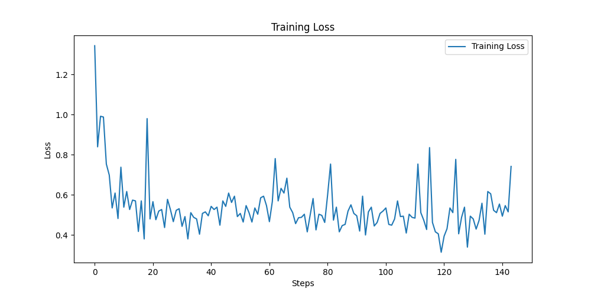

# 3. Model fine-tuning

Now, we will train the model through the following process. 

## Setting Accelerator Flavor

In MoAI Platform, physical GPUs are not directly exposed to users. Instead, virtual MoAI Accelerators are provided, which are available for use in PyTorch. By setting the accelerator's flavor, you can determine how much of the physical GPU will be utilized by PyTorch. Since the total training time and GPU usage cost vary depending on the selected accelerator flavor, users should make decisions based on their training scenarios. Refer to the following document to select the accelerator Flavor that aligns with your training objectives.

- ***[KT Hyperscale AI Computing (HAC) 서비스 가속기 모델 정보](/Supported_Documents/KT_HAC_Models_Info.md)*** 
- [LLM Fine-tuning 파라미터 가이드](/Supported_Documents/LLM_param_guide.md)

!!!
Please refer to the document above or reach out to your infrastructure provider to inquire about the GPU types and quantities corresponding to each flavor.
!!!

***(모든 문서에 추가될 그림 생성 예정)***

You can choose one of the following flavors to proceed:

- AMD MI250 GPU with 16 units:
    - Select [!badge variant="secondary" text="4xlarge"] when using Moreh's trial container.
    - Select [!badge variant="secondary" text="4xLarge.2048GB"] when using KT Cloud's Hyperscale AI Computing.
- AMD MI210 GPU with 32 units.
- AMD MI300X GPU with 8 units.

**Do you remember checking MoAI Accelerator in the [Mistral Fine-tuning (ENG)](index.md) document? Now let's set up the accelerator needed for learning.**

First, we'll use the **`moreh-smi`** command to check the currently used MoAI Accelerator.

```bash
$ moreh-smi
11:40:36 April 16, 2024
+-------------------------------------------------------------------------------------------------+
|                                                Current Version: 24.2.0  Latest Version: 24.2.0  |
+-------------------------------------------------------------------------------------------------+
|  Device  |        Name         |     Model    |  Memory Usage  |  Total Memory  |  Utilization  |
+=================================================================================================+
|  * 0     |   MoAI Accelerator  |  Small.64GB  |  -             |  -             |  -            |
+-------------------------------------------------------------------------------------------------+
```

The current MoAI Accelerator in use has a memory size of 64GB.

You can utilize the `moreh-switch-model` command to review the available accelerator flavors on the current system. For seamless model training, consider using the `moreh-switch-model`command to switch to a MoAI Accelerator with larger memory capacity.

```bash
$ moreh-switch-model
Current MoAI Accelerator: xLarge.512GB

1. Small.64GB
2. Medium.128GB
3. Large.256GB
4. xLarge.512GB  *
5. 1.5xLarge.768GB
6. 2xLarge.1024GB
7. 3xLarge.1536GB
8. 4xLarge.2048GB
9. 6xLarge.3072GB
10. 8xLarge.4096GB
11. 12xLarge.6144GB
12. 24xLarge.12288GB
13. 48xLarge.24576GB
```

You can enter the number to switch to a different flavor.

In this tutorial, we will use a 2048GB-sized MoAI Accelerator.

Therefore, after switching from the initially set [!badge variant="secondary" text=“Small.64GB] flavor to [!badge variant="secondary" text=“4xLarge.2048GB”] , we will use the **`moreh-smi`** command to confirm that the change has been successfully applied.

Enter 8 to use [!badge variant="secondary" text=“4xLarge.2048GB”] 

```bash
Selection (1-13, q, Q): 8
The MoAI Accelerator model is successfully switched to  "4xLarge.2048GB".

1. Small.64GB
2. Medium.128GB
3. Large.256GB
4. xLarge.512GB
5. 1.5xLarge.768GB
6. 2xLarge.1024GB
7. 3xLarge.1536GB
8. 4xLarge.2048GB  *
9. 6xLarge.3072GB
10. 8xLarge.4096GB
11. 12xLarge.6144GB
12. 24xLarge.12288GB
13. 48xLarge.24576GB

Selection (1-13, q, Q): q 
```

Enter **`q`** to complete the change.

To confirm that the changes have been successfully applied, use the **`moreh-smi`** command again to check the currently used MoAI Accelerator.


```bash
$ moreh-smi
23:56:17 April 18, 2024
+-----------------------------------------------------------------------------------------------------+
|                                                    Current Version: 24.2.0  Latest Version: 24.2.0  |
+-----------------------------------------------------------------------------------------------------+
|  Device  |        Name         |       Model      |  Memory Usage  |  Total Memory  |  Utilization  |
+=====================================================================================================+
|  * 0     |   MoAI Accelerator  |  4xLarge.2048GB  |  -             |  -             |  -            |
+-----------------------------------------------------------------------------------------------------+
```

[!badge variant="secondary" text=“4xLarge.2048GB”] 로 잘 변경된 것을 확인할 수 있습니다.

## 학습 실행

주어진 `train_qwen.py` 스크립트를 실행합니다.

```bash
$ cd ~/quickstart
~/quickstart$ python tutorial/train_qwen.py
```

학습이 정상적으로 진행된다면 다음과 같은 로그가 출력될 것입니다. 중간에 파란색으로 표시된 부분을 보시면 Advanced Parallelism 기능이 정상 동작하는 것을 확인할 수 있습니다. 앞서 살펴본 PyTorch 스크립트에서는 AP 코드 한 줄을 제외한 다른 부분에서 GPU 여러 개를 동시에 사용하기 위한 처리가 전혀 없었음을 참고하십시오.

```bash
2024-04-19 01:42:05,158 - torch.distributed.nn.jit.instantiator - INFO - Created a temporary directory at /tmp/tmp5m113wue
2024-04-19 01:42:05,158 - torch.distributed.nn.jit.instantiator - INFO - Writing /tmp/tmp5m113wue/_remote_module_non_scriptable.py
Downloading shards: 100%|██████████| 4/4 [00:00<00:00, 14966.29it/s]
Loading checkpoint shards: 100%|██████████| 4/4 [00:05<00:00,  1.28s/it][2024-04-19 01:42:40.510] [info] Got DBs from backend for auto config.
[2024-04-19 01:42:42.093] [info] Requesting resources for MoAI Accelerator from the server...
[2024-04-19 01:42:42.104] [info] Initializing the worker daemon for MoAI Accelerator
[2024-04-19 01:42:47.290] [info] [1/4] Connecting to resources on the server (192.168.110.5:24168)...
[2024-04-19 01:42:47.302] [info] [2/4] Connecting to resources on the server (192.168.110.23:24168)...
[2024-04-19 01:42:47.310] [info] [3/4] Connecting to resources on the server (192.168.110.45:24168)...
[2024-04-19 01:42:47.316] [info] [4/4] Connecting to resources on the server (192.168.110.73:24168)...
[2024-04-19 01:42:47.323] [info] Establishing links to the resources...
[2024-04-19 01:42:47.742] [info] MoAI Accelerator is ready to use.
[2024-04-19 01:42:48.097] [info] The number of candidates is 16.
[2024-04-19 01:42:48.097] [info] Parallel Graph Compile start...
[2024-04-19 01:43:34.235] [info] Elapsed Time to compile all candidates = 46137 [ms]
[2024-04-19 01:43:34.235] [info] Parallel Graph Compile finished.
[2024-04-19 01:43:34.235] [info] The number of possible candidates is 4.
[2024-04-19 01:43:34.235] [info] SelectBestGraphFromCandidates start...
[2024-04-19 01:43:35.506] [info] Elapsed Time to compute cost for survived candidates = 1271 [ms]
[2024-04-19 01:43:35.506] [info] SelectBestGraphFromCandidates finished.
[2024-04-19 01:43:35.506] [info] Configuration for parallelism is selected.
[2024-04-19 01:43:35.506] [info] num_stages : 2, num_micro_batches : 16, batch_per_device : 1, No TP, recomputation : false, distribute_param : true
[2024-04-19 01:43:35.507] [info] train: true

2024-04-19 01:44:38.243 | INFO     | __main__:main:150 - [Step 1/144] | Loss: 1.34375 | Duration: 57.79 | Throughput: 9072.25 tokens/sec
2024-04-19 01:44:53.592 | INFO     | __main__:main:150 - [Step 2/144] | Loss: 0.83984375 | Duration: 7.42 | Throughput: 70685.21 tokens/sec
2024-04-19 01:45:11.438 | INFO     | __main__:main:150 - [Step 3/144] | Loss: 0.9921875 | Duration: 10.37 | Throughput: 50536.92 tokens/sec
2024-04-19 01:45:28.565 | INFO     | __main__:main:150 - [Step 4/144] | Loss: 0.98828125 | Duration: 9.84 | Throughput: 53281.45 tokens/sec
2024-04-19 01:45:46.302 | INFO     | __main__:main:150 - [Step 5/144] | Loss: 0.75390625 | Duration: 10.41 | Throughput: 50347.46 tokens/sec
2024-04-19 01:46:04.209 | INFO     | __main__:main:150 - [Step 6/144] | Loss: 0.69921875 | Duration: 10.60 | Throughput: 49452.14 tokens/sec
2024-04-19 01:46:22.198 | INFO     | __main__:main:150 - [Step 7/144] | Loss: 0.53515625 | Duration: 10.65 | Throughput: 49214.62 tokens/sec
2024-04-19 01:46:37.560 | INFO     | __main__:main:150 - [Step 8/144] | Loss: 0.609375 | Duration: 7.67 | Throughput: 68339.57 tokens/sec
2024-04-19 01:46:55.414 | INFO     | __main__:main:150 - [Step 9/144] | Loss: 0.482421875 | Duration: 10.43 | Throughput: 50256.04 tokens/sec
...
2024-04-19 02:22:56.201 | INFO     | __main__:main:150 - [Step 139/144] | Loss: 0.51171875 | Duration: 8.05 | Throughput: 65134.47 tokens/sec
2024-04-19 02:23:13.305 | INFO     | __main__:main:150 - [Step 140/144] | Loss: 0.5546875 | Duration: 9.57 | Throughput: 54804.19 tokens/sec
2024-04-19 02:23:28.836 | INFO     | __main__:main:150 - [Step 141/144] | Loss: 0.494140625 | Duration: 7.58 | Throughput: 69209.20 tokens/sec
2024-04-19 02:23:47.302 | INFO     | __main__:main:150 - [Step 142/144] | Loss: 0.546875 | Duration: 10.52 | Throughput: 49843.95 tokens/sec
2024-04-19 02:24:05.560 | INFO     | __main__:main:150 - [Step 143/144] | Loss: 0.515625 | Duration: 10.67 | Throughput: 49114.75 tokens/sec
2024-04-19 02:24:20.923 | INFO     | __main__:main:150 - [Step 144/144] | Loss: 0.7421875 | Duration: 7.68 | Throughput: 68246.97 tokens/sec
total_step: 144
Training Done
Saving Model...
Model saved in ./qwen_code_generation
```

You can confirm that the training is progressing smoothly by observing the loss values appearing as follows.



The throughput displayed during training indicates how many tokens per second are being processed through the PyTorch script.

- When using 16 AMD MI250 GPUs: approximately 59,000 tokens/sec

Approximate training time based on GPU type and quantity is as follows:

- When using 16 AMD MI250 GPUs: approximately 40 minutes

## Checking Accelerator Status During Training

During training, open another terminal and connect to the container. You can execute the `moreh-smi` command to observe the MoAI Accelerator occupying memory while the training script is running. Please check the memory occupancy of MoAI accelerator when the training loss appears in the execution log after the initialization process.

```bash
$ moreh-smi
01:49:22 April 19, 2024
+-----------------------------------------------------------------------------------------------------+
|                                                    Current Version: 24.2.0  Latest Version: 24.2.0  |
+-----------------------------------------------------------------------------------------------------+
|  Device  |        Name         |       Model      |  Memory Usage  |  Total Memory  |  Utilization  |
+=====================================================================================================+
|  * 0     |   MoAI Accelerator  |  4xLarge.2048GB  |  853677 MiB    |  2096640 MiB   |  100 %        |
+-----------------------------------------------------------------------------------------------------+

Processes:
+------------------------------------------------------------------------------------+
|  Device  |  Job ID  |    PID    |             Process             |  Memory Usage  |
+====================================================================================+
|       0  |  975583  |  4090049  |  python tutorial/train_qwen.py  |  853677 MiB    |
+------------------------------------------------------------------------------------+
```

