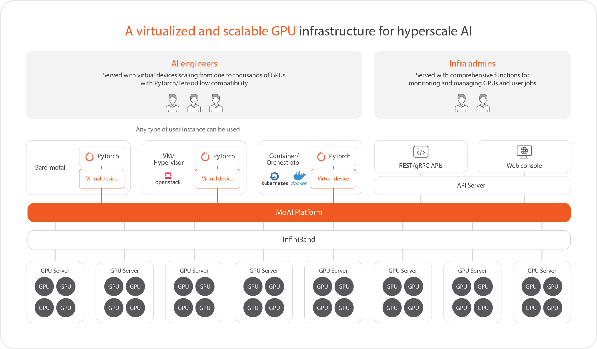

# MoAI Platform 문서

**MoAI(Moreh AI appliance for AI accelerators)** 은 대규모 딥러닝 모델 개발에 필수적인 그래픽 처리 장치(GPU)를 손쉽게 제어할 수 있는 확장 가능한 AI 플랫폼입니다.

- **Virtual GPU Clusters** - 가상화된 GPU 클러스터에 접근하고 이를 활용하여 컴퓨팅 자원을 원활하게 확장할 수 있습니다.
- **Fine-Tuning** - 몇 가지 명령어만으로 파인튜닝을 수행하고, 파인 튜닝된 모델을 추론에 배포할 수 있습니다.
- **Advanced Parallelization** - 모델 훈련을 최적화하기 위해 고급 병렬 처리 기술을 손쉽게 적용할 수 있습니다.

----

### Getting Started

   | 
---    | ---
 [ **Fine-tuning 시작하기**](Tutorials/index.md)   MoAI Platform을 처음 사용하는 사용자에게 필요한 정보 안내 | [ **AP(Advanced Parallelization)**](/Supported_Documents/AP/ap_guide.md)   Advanced Parallelization (AP) 기능 사용 안내 
[ **Moreh Toolkit**](/ko/Supported_Documents/moreh_toolkit.md)   command line 사용방법 |[ **MoAI Platform Features**](/MoAI_Features/index.md)   MoAI Platform의 가상화와 병렬화 기능

## MoAI Platform이란?
MoAI Platform은 대규모 딥러닝 모델을 개발하기 위한 확장 가능한 AI 플랫폼으로, 수천 대의 GPU를 쉽게 제어하여 AI 모델을 학습하거나 추론할 수 있습니다.

## MoAI Platform 핵심 기술

딥러닝 모델이 진화함에 따라 파라미터가 수십억~수백억 단위로 확장되는 등 점점 복잡해지면서 대규모의 컴퓨팅 리소스가 AI 인프라의 필수 요소가 되었습니다. 대규모 모델을 개발할 때 수동 병렬 처리와 GPU 및 노드 관리를 통해 모델 학습을 최적화하는 과정이 필요하며 이로 인해 개발자들의 많은 노력과 시간이 많이 소요됩니다.

또한, 대규모 모델을 학습하고 추론하는 과정에서 GPU 노드 장애, 메모리 한계 및 병목 현상 등의 이슈가 종종 발생하여, 이를 해결하는 것은 매우 까다로운 작업입니다.

MoAI Platform의 GPU 가상화 기능과 자동 병렬화 기능은 이러한 한계와 어려움을 다음 기능으로 해결하여 대규모 AI 시대에 효율적인 인프라를 제공합니다.

1. **[다양한 가속기, 다중 GPU 지원](http://docs.moreh.io/about-moai/#1-다양한-가속기-다중-gpu-지원)**
2. **[GPU 가상화](http://docs.moreh.io/about-moai/#2-gpu-가상화)**
3. **[동적 GPU 할당](http://docs.moreh.io/about-moai/#3-동적-gpu-할당)**
4. **[AI Compiler 자동 병렬화](http://docs.moreh.io/about-moai/#4-ai-compiler-자동-병렬화)**

---

Copyright © 2024 Moreh Corporation
