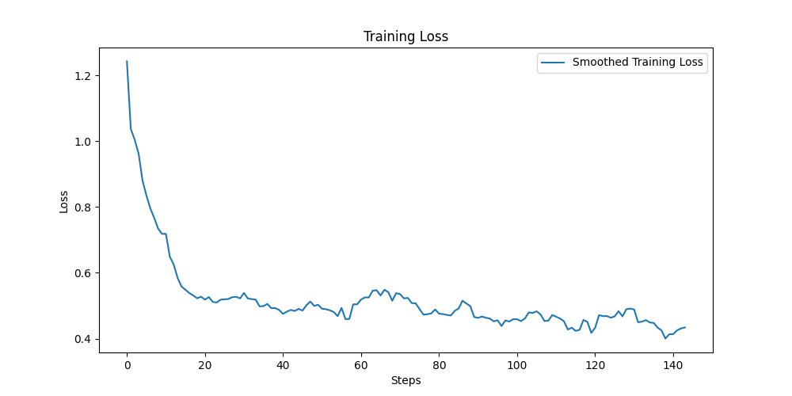

# 3. 학습 실행하기

이제 실제로 fine tuning을 실행해 보겠습니다.

## 가속기 Flavor 설정

MoAI Platform에서는 사용자에게 물리 GPU가 노출되지 않습니다. 대신 PyTorch에서 사용 가능한 가상의 MoAI Accelerator가 제공됩니다. 가속기의 flavor를 설정함으로써 실제로 PyTorch에서 물리 GPU를 얼마나 활용할지를 결정할 수 있습니다. 선택한 가속기 Flavor에 따라 학습 총 시간 및 gpu 사용 비용이 달라지므로 사용자의 학습 상황에 따른 판단이 필요합니다. 사용자의 학습 목표에 맞는 가속기 Flavor를 선택하기 위해 [LLM Fine-tuning 파라미터 가이드](/Supported_Documents/LLM_param_guide.md)를 참고하세요.

!!!
튜토리얼을 계속 진행하기 위해 인프라 제공자에게 각 flavor에 대응되는 GPU 종류 및 개수를 문의하십시오. 다음 중 하나에 해당하는 flavor를 선택하여 계속 진행하십시오.
!!!


- AMD MI250 GPU 16개 사용
    - Moreh의 체험판 컨테이너 사용 시: [!badge variant="secondary" text=4xlarge] 선택
    - KT Cloud의 Hyperscale AI Computing 사용 시: [!badge variant="secondary" text=4xLarge.2048GB] 선택
- AMD MI210 GPU 32개 사용
- AMD MI300X GPU 8개 사용


앞서 [**Mistral Fine-tuning - 시작하기 전에**](index.md) 에서 MoAI Accelerator를 확인했던 것을 기억하시나요? 이제 본격적인 학습 실행을 위해 필요한 가속기를 설정해보겠습니다.

먼저 `moreh-smi` 명령어를 이용해 현재 사용중인 MoAI Accelerator를 확인합니다.

```bash
$ moreh-smi
+-------------------------------------------------------------------------------------------------+
|                                                Current Version: 24.5.0  Latest Version: 24.5.0  |
+-------------------------------------------------------------------------------------------------+
|  Device  |        Name         |     Model    |  Memory Usage  |  Total Memory  |  Utilization  |
+=================================================================================================+
|  * 0     |   MoAI Accelerator  |  Small.64GB  |  -             |  -             |  -            |
+-------------------------------------------------------------------------------------------------+
```

현재 사용중인 MoAI Accelerator의 메모리 크기는 64GB입니다. 

`moreh-switch-model` 툴을 사용하여 현재 시스템에서 사용 가능한 가속기 flavor 리스트를 확인할 수 있습니다. 원활한 모델 학습을 위해 `moreh-switch-model` 명령어를 이용해 더 큰 메모리의 MoAI Accelerator로 변경할 수 있습니다. 

```bash
$ moreh-switch-model
Current MoAI Accelerator: Small.64GB

1. Small.64GB  *
2. Medium.128GB
3. Large.256GB
4. xLarge.512GB
5. 1.5xLarge.768GB
6. 2xLarge.1024GB
7. 3xLarge.1536GB
8. 4xLarge.2048GB
9. 6xLarge.3072GB
10. 8xLarge.4096GB
11. 12xLarge.6144GB
12. 24xLarge.12288GB
13. 48xLarge.24576GB
```

여기서 번호를 입력하여 다른 flavor로 전환할 수 있습니다. 

이번 튜토리얼에서는 2048GB 크기의 MoAI Accelerator를 이용하겠습니다.

따라서 처음 설정되어 있던 [!badge variant="secondary" text=Small.64GB] flavor를 [!badge variant="secondary" text=4xLarge.2048GB]로 전환한 다음 `moreh-smi` 명령을 사용하여 정상적으로 반영되었는지 확인하겠습니다. 

[!badge variant="secondary" text=4xLarge.2048GB] 사용을 위해 8을 입력합니다.


```bash
Selection (1-13, q, Q): 8
The MoAI Accelerator model is successfully switched to  "4xLarge.2048GB".

1. Small.64GB
2. Medium.128GB
3. Large.256GB
4. xLarge.512GB
5. 1.5xLarge.768GB
6. 2xLarge.1024GB
7. 3xLarge.1536GB
8. 4xLarge.2048GB  *
9. 6xLarge.3072GB
10. 8xLarge.4096GB
11. 12xLarge.6144GB
12. 24xLarge.12288GB
13. 48xLarge.24576GB

Selection (1-13, q, Q): q
```

`q` 를 입력해 변경을 완료합니다.

변경 사항이 잘 반영되었는지 확인하기 위해 다시 `moreh-smi` 명령어를 이용해 현재 사용중인 MoAI Accelerator를 확인합니다.

```bash
$ moreh-smi
+-----------------------------------------------------------------------------------------------------+
|                                                    Current Version: 24.5.0  Latest Version: 24.5.0  |
+-----------------------------------------------------------------------------------------------------+
|  Device  |        Name         |       Model      |  Memory Usage  |  Total Memory  |  Utilization  |
+=====================================================================================================+
|  * 0     |   MoAI Accelerator  |  4xLarge.2048GB  |  -             |  -             |  -            |
+-----------------------------------------------------------------------------------------------------+
```

[!badge variant="secondary" text=4xLarge.2048GB] 로 잘 변경된 것을 확인할 수 있습니다.

## 학습 실행

주어진 `train_mistral.py` 스크립트를 실행합니다.

```
$ cd ~/quickstart
~/quickstart$ python tutorial/train_mistral.py
```

학습이 정상적으로 진행된다면 다음과 같은 로그가 출력 될 것입니다. 중간에 파란색으로 표시된 부분을 보시면 Advanced Parallelism 기능이 정상 동작하는 것을 확인할 수 있습니다. 앞서 살펴 본 PyTorch 스크립트 상에서는 GPU 여러 개를 동시에 사용하기 위한 처리가 전혀 없었음을 참고하십시오.

```
...
[info] Got DBs from backend for auto config.
[info] Requesting resources for MoAI Accelerator from the server...
[info] Initializing the worker daemon for MoAI Accelerator
[info] [1/4] Connecting to resources on the server (192.168.110.4:24166)...
[info] [2/4] Connecting to resources on the server (192.168.110.25:24166)...
[info] [3/4] Connecting to resources on the server (192.168.110.61:24166)...
[info] [4/4] Connecting to resources on the server (192.168.110.88:24166)...
[info] Establishing links to the resources...
[info] MoAI Accelerator is ready to use.
[info] Moreh Version: 24.5.0
[info] Moreh Job ID: 977790
[info] The number of candidates is 54.
[info] Parallel Graph Compile start...
[info] Elapsed Time to compile all candidates = 142319 [ms]
[info] Parallel Graph Compile finished.
[info] The number of possible candidates is 44.
[info] SelectBestGraphFromCandidates start...
[info] Elapsed Time to compute cost for survived candidates = 71233 [ms]
[info] SelectBestGraphFromCandidates finished.
[info] Configuration for parallelism is selected.
[info] No PP, No TP, recomputation : default(1), distribute_param : true, distribute_low_prec_param : true
[info] train: true
| INFO     | __main__:main:131 - [Step 1/36] | Loss: 1.1953125 | Duration: 272.37 | Throughput: 1924.89 tokens/sec
| INFO     | __main__:main:131 - [Step 2/36] | Loss: 0.88671875 | Duration: 1.37 | Throughput: 383089.82 tokens/sec
| INFO     | __main__:main:131 - [Step 3/36] | Loss: 0.73046875 | Duration: 1.29 | Throughput: 407897.67 tokens/sec
| INFO     | __main__:main:131 - [Step 4/36] | Loss: 0.609375 | Duration: 1.34 | Throughput: 392018.30 tokens/sec
| INFO     | __main__:main:131 - [Step 5/36] | Loss: 0.61328125 | Duration: 1.32 | Throughput: 395868.81 tokens/sec
| INFO     | __main__:main:131 - [Step 6/36] | Loss: 0.6015625 | Duration: 1.34 | Throughput: 390184.47 tokens/sec
...
Training Done
Saving Model...
Model saved in ./mistral_code_generation
```

Loss 값이 다음과 같이 나타나며 정상 학습이 이루어지는 것을 확인할 수 있습니다.



학습 도중에 출력되는 throughput은 해당 PyTorch 스크립트를 통해 초당 몇 개의 token을 학습하고 있는지를 의미합니다.

- AMD MI250 GPU 16개 사용 시: 약 390,000 tokens/sec

GPU 종류 및 개수에 따른 대략적인 학습 소요 시간은 다음과 같습니다.

- AMD MI250 GPU 16개 사용 시: 약 15분

## 학습 중에 가속기 상태 확인

학습 중에 터미널을 하나 더 열어서 컨테이너에 접속한 후에 `moreh-smi` 명령을 실행하면 MoAI Accelerator의 메모리를 차지하며 학습 스크립트가 실행되고 있는 것을 확인할 수 있습니다. 실행 로그를 보면 초기화가 완료되고 Loss가 출력되는 도중에 확인해 보시기 바랍니다.

```bash
$ moreh-smi
+-----------------------------------------------------------------------------------------------------+
|                                                    Current Version: 24.5.0  Latest Version: 24.5.0  |
+-----------------------------------------------------------------------------------------------------+
|  Device  |        Name         |       Flavor     |  Memory Usage  |  Total Memory  |  Utilization  |
+=====================================================================================================+
|  * 0     |  MoAI Accelerator   |  4xLarge.2048GB  |  1739561 MiB   |  2096640 MiB   |     100%      |
+-----------------------------------------------------------------------------------------------------+

Processes:
+--------------------------------------------------------------------------------------+
|  Device  |  Job ID  |    PID    |             Process               |  Memory Usage  |
+======================================================================================+
|       0  |  977790  |  2219280  |  python tutorial/train_mistral.py |  1739561 MiB   |
+--------------------------------------------------------------------------------------+
```

