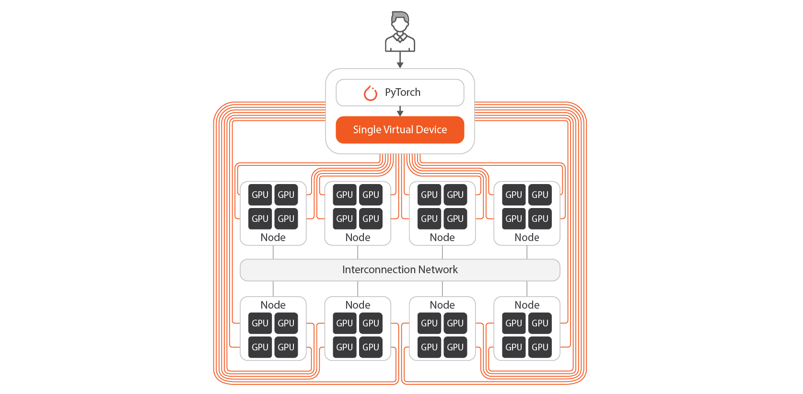

# 개요

## MoAI Platform이란?
MoAI Platform은 대규모 딥러닝 모델을 개발하기 위한 확장 가능한 AI 플랫폼으로, 수천 대로 이루어진 GPU 클러스터를 쉽게 제어하여 AI 모델을 학습하거나 추론할 수 있습니다.

## MoAI Platform 핵심 기술

딥러닝 모델이 발전하면서 수십억, 수백억 개의 파라미터를 포함하는 복잡한 구조가 되었고, 이에 따라 대규모 컴퓨팅 자원이 AI  인프라의 중요한 부분이 되었습니다. 대규모 컴퓨팅 자원을 사용하여 모델을 개발하려면 모델의 병렬 처리와 클러스터 환경의 수동 설정과 같이 학습 프로세스를 최적화하는 과정이 필수적입니다. 특히, GPU 및 노드 관리를 통한 학습 최적화는 개발자들에게 많은 시간과 노력을 요구합니다.
MoAI Platform은 이러한 문제를 해결하기 위해 다음과 같은 기능을 제공하여 대규모 AI 시대에 효율적인 인프라를 지원합니다.

1. **[다양한 가속기, 다중 GPU 지원](#1-다양한-가속기-다중-gpu-지원)**
2. **[GPU 가상화](#2-gpu-가상화)**
3. **[동적 GPU 할당](#3-동적-gpu-할당)**
4. **[AI Compiler 자동 병렬화](#4-ai-compiler-자동-병렬화)**

---

## 1. 다양한 AI 가속기 지원

-

MoAI Platform은 다양한 AI 가속기를 지원하기 때문에 가속기 종류와 상관없이 다양한 모델 학습과 추론 작업을 실행할 수 있습니다.
사용자는 AMD, Intel 및 NVIDIA 외의 다른 AI 가속기와 함께 사용할 수 있으며, 이를 위해 기존에 활용하던 Python으로 작성된 학습 및 추론 코드를 수정할 필요가 없습니다.
\
&nbsp;

## 2. GPU 가상화

-
&nbsp;

MoAI Platform의 가상화 기능은 수천 개의 GPU를 하나의 GPU처럼 사용할 수 있게 합니다(Single Virtual Device). 이를 통해 멀티 GPU, 멀티 노드 병렬화 작업과 같은 최적화 프로세스가 필요없이 1개의 GPU를 가정하고 Python 코드를 구성할 수 있기 때문에 AI 엔지니어가 쉽고 빠르게 딥러닝 학습 및 추론을 실행할 수 있습니다.

- 필요에 따라 GPU 자원을 확장하거나 축소할 수 있어 서비스의 확장성을 높일 수 있습니다. MoAI Platform에서는 간단한 명령어 한 줄로 1개의 Single Virtual Device 로 가상화될 GPU 자원을 손쉽게 확장하고 축소할 수 있습니다.
&nbsp;

## 3. 동적 GPU 할당

Public Cloud에서는 VM 인스턴스 생성 시 과금이 시작되며, GPU를 변경하려면 인스턴스를 다시 생성해야 합니다. 또한 선택한 가상 머신이 한 번 확정되면 학습에 따라 유연하게 변경하기 어려운 경우도 많습니다.

MoAI Platform은 **실제로 연산중일 때만 AI 가속기 사양에 따라 분 단위로 요금이 부과**할 수 있는 설계이므로, 유저의 GPU 실사용시에만 과금하는 완전한 종량제 방식이 가능합니다. 이용자의 사용 패턴에 맞추어 기존 클라우드 서비스의 GPU를 특정 가상머신(VM)에 종속시키는 Passthrough 방식 대비 대규모의 비용 절감이 가능합니다.

## 4. AI Compiler 자동 병렬화

!!!info **자동 병렬화란?** 
딥러닝 모델은 여러 개의 레이어로 이루어져 있고, 각 레이어는 다양한 연산을 포함하고 있습니다. 이러한 연산들은 독립적으로 학습될 수 있어 병렬 처리가 가능합니다. 그러나 이를 위해 ML 엔지니어는 파라미터와 환경 변수의 조합을 수동으로 설정해야 합니다.
MoAI Platform의 자동 병렬화 기능은 최적의 병렬화 환경 변수 조합을 신속하게 결정합니다.
따라서 사용자는 대규모 모델 훈련 시 필요한 [Data Parallelism](https://pytorch.org/docs/stable/generated/torch.nn.DataParallel.html), [DDP](https://pytorch.org/tutorials/intermediate/ddp_tutorial.html), [Pipeline Parallelism](https://pytorch.org/docs/stable/pipeline.html), and [Tensor Parallelism](https://pytorch.org/tutorials/intermediate/TP_tutorial.html) 등의 병렬화 기법을 자동으로 적용하여 모델을 훈련할 수 있습니다.
!!!

인공지능 시대에는 대형 언어 모델(LLM) 및 대형 멀티모달 모델(LMM)과 같은 대규모 모델의 훈련 및 추론에 상당한 규모의 GPU 클러스터와 효과적인 GPU 병렬화가 필요합니다. 

현재 NVIDIA와 함께 사용되는 일반적인 AI 프레임워크는 모델의 크기와 복잡성, 그리고 사용 가능한 GPU의 크기나 클러스터에 따라 AI 엔지니어가 병렬화를 수동으로 조정해야 합니다. 이 과정은 시간이 많이 소요되며 종종 몇 주가 걸립니다.

- MoAI 플랫폼은 특정 AI 모델과 GPU 클러스터의 크기를 기반으로 GPU 리소스를 최적으로 활용하는 Moreh AI 컴파일러를 통해 자동 병렬화를 제공합니다.
- 자동 병렬화를 통해 NVIDIA 환경(플랫폼)에서 몇 주가 소요되는 모델 훈련을 대략 2~3일로 대폭 단축할 수 있습니다.
