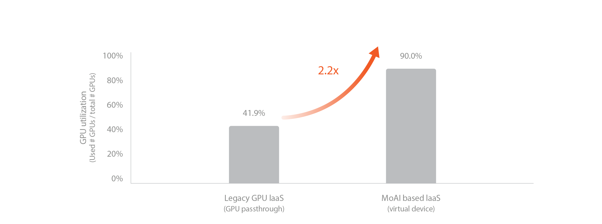
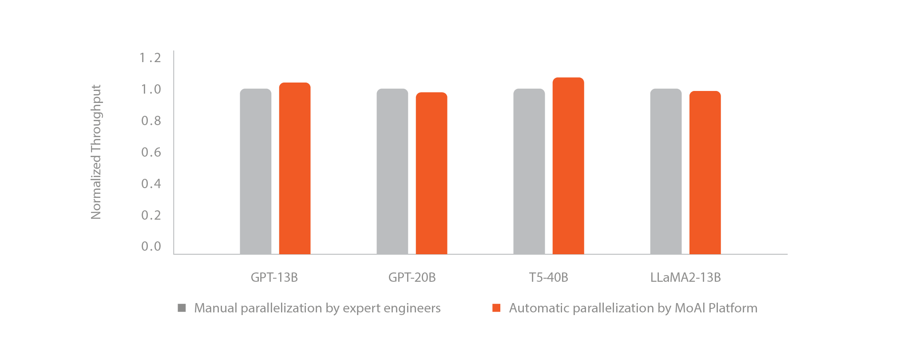

# Overview

## What is MoAI Platform?

The MoAI Platform is an AI platform for the development of large-scale deep learning models, simplifying the management of thousands of GPU clusters necessary for training and inference of AI models.

## Core Technologies of MoAI Platform

As deep learning models advance, they become increasingly intricate, comprising numerous layers with a vast number of parameters. Consequently, large-scale computing resources have become essential elements of AI infrastructure. Utilizing these resources to develop models entails optimizing the training process, including parallelizing the model and manually configuring the cluster environment. Effectively managing GPU and node resources for optimal training demands considerable time and effort from developers.

To address these challenges, the MoAI Platform offers the following features to facilitate efficient infrastructure in the era of large-scale AI:

1. [**Support Various Accelerators with Single GPU Abstraction**](#1-various-accelerators-multi-gpu-support)
2. [**GPU Virtualization**](#2-gpu-virtualization)
3. [**Dynamic GPU Allocation**](#3-dynamic-gpu-allocation)
4. [**AI Compiler Automatic Parallelization**](#4-ai-compiler-automatic-parallelization)

---

## 1. Support Various Accelerators with Single GPU Abstraction

-

MoAI Platform supports various AI accelerators, allowing users to execute diverse model training and inference tasks regardless of accelerator type. Users can seamlessly utilize accelerators other than NVIDIA without the need to modify existing code written in Python.
\
&nbsp;

## 2. GPU Virtualization

The virtualization feature of the MoAI Platform enables thousands of GPUs to be utilized as a singular unit, known as a Single Virtual Device. This allows AI engineers to easily and quickly conduct deep learning training and inference tasks without the complexities associated with multi-GPU and multi-node parallelization. 
By assuming only one GPU and structuring Python code accordingly, users can perform these tasks effortlessly.

Users can expand or shrink GPU resources as needed, increasing the scalability of the service. With a simple one-line command in the MoAI Platform, GPU resources virtualized into a single virtual device can be easily expanded or contracted. 
\
&nbsp;

## 3. Dynamic GPU Allocation

In public cloud, billing starts when VM instances are created, and changing GPUs requires recreating the instances. Furthermore, once selected, it can be challenging to flexibly change the chosen virtual machine, which can hinder optimization according to the user's needs.

The MoAI Platform is designed to charge fees on a per-minute basis only when AI accelerators are actually in operation, allowing for a complete pay-as-you-go system. This design enables significant cost savings compared to existing cloud services by freeing GPUs from dependency on specific virtual machines (VMs) according to user usage patterns.
\
&nbsp;

## 4. AI Compiler Automatic Parallelization

!!!info What is Automatic Parallelization?
Deep learning models consist of multiple layers, each containing various operations. These operations can be learned independently, enabling parallel processing. However, ML engineers must manually configure combinations of parameters and environment variables for this purpose. The MoAI Platform's automatic parallelization feature swiftly determines the optimal combination of parallelization environment variables. As a result, users can train models automatically applying parallelization techniques such as [Data Parallelism](https://pytorch.org/docs/stable/generated/torch.nn.DataParallel.html), [DDP](https://pytorch.org/tutorials/intermediate/ddp_tutorial.html), [Pipeline Parallelism](https://pytorch.org/docs/stable/pipeline.html), and [Tensor Parallelism](https://pytorch.org/tutorials/intermediate/TP_tutorial.html) during large-scale model training.
!!!

In the era of artificial intelligence, training and inference of large-scale models such as Large Language Models (LLMs) and Large Multimodal Models (LMMs) require substantial GPU clusters and effective GPU parallelization.

Current mainstream AI frameworks, often used alongside NVIDIA, require AI engineers to manually adjust parallelization based on the size and complexity of the model, as well as the available GPU size or cluster. This process is time-consuming and can often take several weeks.

- The MoAI platform offers automatic parallelization through the Moreh AI compiler, which optimizes GPU resources based on the size of a specific AI model and GPU cluster.
- Automatic parallelization can drastically reduce the training time for models that typically take weeks in NVIDIA environments (platforms) to approximately 2-3 days.
