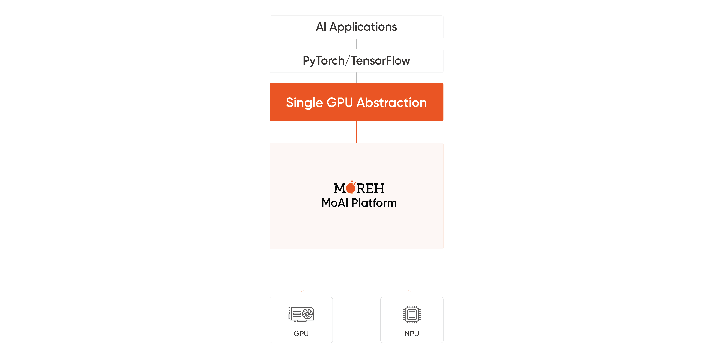

---

order: 112
---

# Support Various Accelerators with Single GPU Abstraction

-

MoAI Platform supports various AI accelerators, allowing users to execute diverse model training and inference tasks regardless of accelerator type. Users can seamlessly utilize accelerators other than NVIDIA without the need to modify existing code written in Python.
\
&nbsp;

