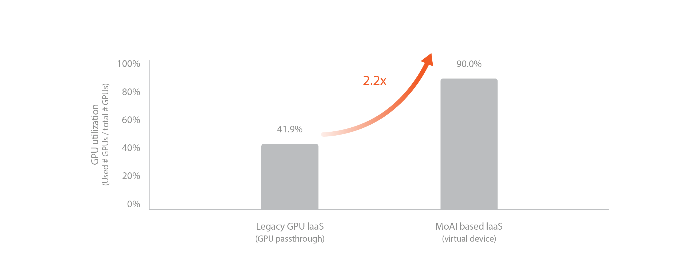

---

order: 100
---

# Dynamic GPU Allocation

In public cloud, billing starts when VM instances are created, and changing GPUs requires recreating the instances. Furthermore, once selected, it can be challenging to flexibly change the chosen virtual machine, which can hinder optimization according to the user's needs.

The MoAI Platform is designed to charge fees on a per-minute basis only when AI accelerators are actually in operation, allowing for a complete pay-as-you-go system. This design enables significant cost savings compared to existing cloud services by freeing GPUs from dependency on specific virtual machines (VMs) according to user usage patterns.