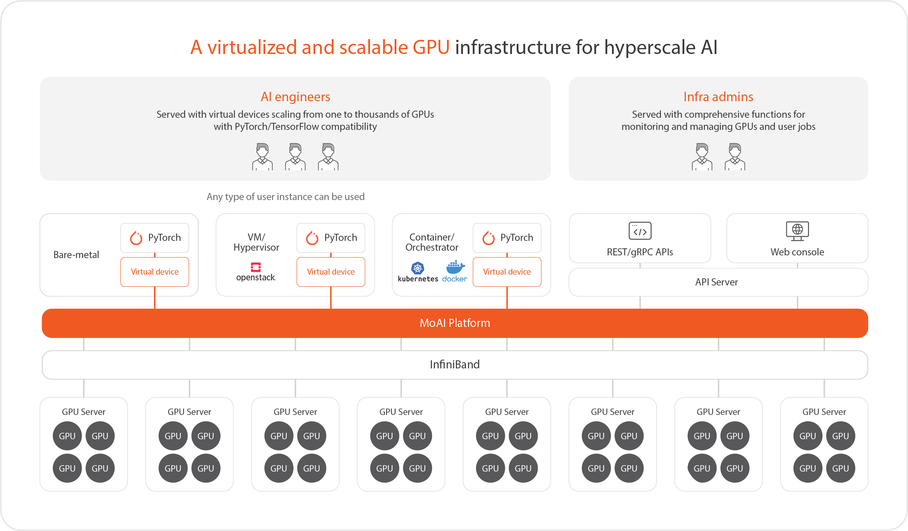

# MoAI Platform Guide

**MoAI(Moreh AI appliance for AI accelerators)** Platform is a scalable AI platform that enables easy control of thousands of Graphics Processing Units(GPUs) essential for developing large-scale deep learning models.

- **Virtual GPU Clusters** - Access and utilize virtualized GPU clusters to scale your computational resources seamlessly.
- **Fine-Tuning** - Fine-tune with a few commands and deploy your fine-tuned model for inference.
- **Advanced Parallelism** - Employ advanced parallelism techniques effortlessly to optimize model training.

----

### Getting Started

   | 
---    | ---
 [ **Get started with fine-tuning**](Tutorials/index.md)   MoAI Platform Beginner's Guide for Finetuning| [ **AP Guide**](/Supported_Documents/AP/ap_guide.md)   Advanced Parallelization (AP) Feature Instructions
[ **Moreh Toolkit Guide**](Tutorials/index.md)   Command Line Usage |[ **MoAI Platform Features**](/MoAI_Features/index.md)   The virtualization and parallelization features of the MoAI Platform

## What is MoAI Platform?

MoAI(Moreh AI appliance for AI accelerators) Platform is a scalable AI platform that enables easy control of thousands of Graphics Processing Units(GPUs) essential for developing large-scale deep learning models.

## Core Technologies of MoAI Platform

As deep learning models evolve, they become increasingly complex and require substantial computational resources, with parameters expanding from billions to trillions. Developing large-scale models involves managing and processing an immense number of parameters, which is very challenging and time-consuming.

The MoAI Platform's automatic parallelization addresses these challenges by simultaneously processing multiple tasks, determining the optimal calculation method for large models. This allows users to focus solely on their core AI challenges, regardless of their application scale or processor type. Furthermore, it efficiently utilizes GPU computational resources at a reasonable cost by allocating them only during calculation execution.

1. **[Various Accelerators, Multi-GPU Support](http://localhost:5000/two-lang-demo/about-moai/#1various-accelerators-multi-gpu-support)**
2. **[GPU/NPU Virtualization](http://localhost:5000/two-lang-demo/about-moai/#2-gpunpu-virtualization)**
3. **[AI Compiler]()**
4. **[Dynamic GPU Allocation]()**

---

Copyright © 2024 Moreh Corporation

