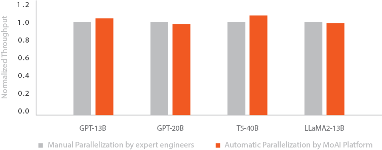

# MoAI Platform Guide

**MoAI(Moreh AI appliance for AI accelerators)** Platform is a scalable AI platform that enables easy control of thousands of Graphics Processing Units(GPUs) essential for developing large-scale deep learning models.

- **Virtual GPU Clusters** - Access and utilize virtualized GPU clusters to scale your computational resources seamlessly.
- **Fine-Tuning** - Fine-tune with a few commands and deploy your fine-tuned model for inference.
- **Advanced Parallelism** - Employ advanced parallelism techniques effortlessly to optimize model training.

----

### Getting Started

   | 
---    | ---
 [ **Get started with fine-tuning**](Tutorials/index.md)   MoAI Platform Beginner's Guide for Finetuning| [ **AP Guide**](/Supported_Documents/AP/ap_guide.md)   Advanced Parallelization (AP) Feature Instructions
[ **Moreh Toolkit Guide**](Tutorials/index.md)   Command Line Usage |[ **MoAI Platform Features**](/MoAI_Features/index.md)   The virtualization and parallelization features of the MoAI Platform

## What is MoAI Platform?

MoAI(Moreh AI appliance for AI accelerators) Platform is a scalable AI platform that enables easy control of thousands of Graphics Processing Units(GPUs) essential for developing large-scale deep learning models.

## Core Technologies of MoAI Platform

As deep learning models evolve, they become increasingly complex and require substantial computational resources, with parameters expanding from billions to trillions. Developing large-scale models involves managing and processing an immense number of parameters, which is very challenging and time-consuming.

The MoAI Platform's automatic parallelization addresses these challenges by simultaneously processing multiple tasks, determining the optimal calculation method for large models. This allows users to focus solely on their core AI challenges, regardless of their application scale or processor type. Furthermore, it efficiently utilizes GPU computational resources at a reasonable cost by allocating them only during calculation execution.

1. **[Various Accelerators, Multi-GPU Support](http://localhost:5000/two-lang-demo/about-moai/#1various-accelerators-multi-gpu-support)**
2. **[GPU/NPU Virtualization](http://localhost:5000/two-lang-demo/about-moai/#2-gpunpu-virtualization)**
3. **[AI Compiler]()**
4. **[Dynamic GPU Allocation]()**

---

### **1.Various Accelerators, Multi-GPU Support**

-

\
\
\
\
\
\
&nbsp;
&nbsp;

- MoAI Platform supports various accelerators capable of executing various types of operations regardless of types of GPUs.
- Users can utilize different accelerators like Intel, AMD, and others alongside NVIDIA without needing to modify their code for deep learning development and model training.
- This compatibility allows for flexible development and training of deep learning models, accommodating multiple and diverse types of GPUs.\
\
\
\
\
\
\
\
&nbsp;
&nbsp;

------

### 2. GPU/NPU Virtualization

-

\
\
\
\
\
\
&nbsp;
&nbsp;

- The MoAI Platform's virtualization feature enables thousands of GPUs or NPUs to function as a single, more powerful GPU device.
    - This unique approach suggests that instead of managing a lot of individual units, users can handle this collective resource as single entity, considerably simplifying complex tasks.
- It simplifies the process of modeling and optimization, providing users with a seamless and efficient experience.
    - By abstracting the complexity of utilizing multiple GPUs or NPUs, it enables easier management and deployment of resources for enhanced performance in deep learning tasks.
\
\
\
\
\
\
&nbsp;
&nbsp;

------

### 3. AI Compiler

- In the era of AI, training and inference of large-scale models such as LLM(Large language Model) and LMM(Large Multimodal Model) require significantly large GPU clusters and effective GPU parallelization.
- Currently, most AI frameworks used with NVIDIA require manual parallelization by AI engineers depending on the size and complexity of the model and the available GPU size/cluster. This setup process is time-consuming, often taking weeks to complete.
- The MoAI Platform offers automatic parallelization can be achieved through a Moreh AI compiler that finds out the optical way to use GPU resources based on the the specific AI model and the size of GPU cluster.
- This can significantly shorten the setup and deployment time for AI models, from several weeks, as with NVIDIA, to only 2-3 days.

## 4. Dynamic GPU Allocation

- On the MoAI platform, AI engineers can begin deep learning training with exactly the amount of GPU resources as needed.
- GPU resources are only allocated during computation execution, allowing for efficient use of GPU resources. This not only reduces software development cost, but also saves time for development and deployment.

Copyright © 2024 Moreh Corporation

